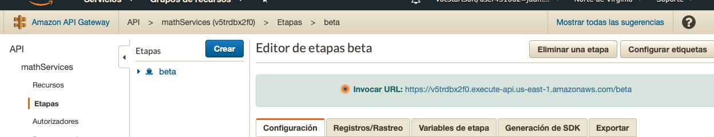

# Amazon Gateway y Lambda
# 2019-2  Arquitectura empresarial Grupo: 1

# Profesor
## Luis Daniel Benavides Navarro, Ph.D. 

# Integrante
## Juan Pablo Ospina Henao

## Compile and run instructions

* Para ejecutar empaquetar:
mvn package

* Para ejecutar el jar 
mvn -jar AWSLambdaGateway-1.0-SNAOSHOT.jar

# Reporte

Se debe tener el servicio de api gateway conel fin de que la app lo pueda consultar

Se realiza la peticon a la api para obtner el valor determinado por le formulario como se puede ver en la sigueinte imagen

Se debe tener presente los diferentes puertos que puede acceder a el recurso de la maquina ec2 creada, para ello
se debe addicionar puertos que permitan la conexion por ejemplo el 8080 o permitir cualquier puerto para el inbound 

En la maquina ec2 se pone a correr el jar de la aplicacion

Como se puede observar se puede acceder al recurso de al app por medio de la url que nos proporcino la ec2 por medio del puerto de spark

y por ultimo el resultado de que funciona al api 

